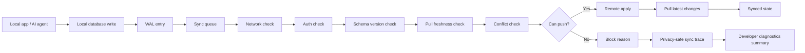

# SET Engine

Local-first sync diagnostics PoC that generates a privacy-safe explainability trace for database writes.

## Live Demo

Placeholder: `https://your-demo-link.example`

## Screenshot

Placeholder: add a screenshot of the dashboard here.

## Problem Statement

Local-first apps, offline-first apps, edge apps, embedded databases, and AI agent memory systems often make a write look simple while the sync path underneath is not. A write can be pending locally, blocked by auth, waiting on a pull, delayed by schema drift, or rejected by a row conflict. SET Engine shows those decisions as a readable trace instead of a black box.

## Why Local-First Sync Debugging Is Hard

- Local writes are often durable before they are synchronizable.
- Network, auth, and schema checks can fail independently.
- Conflict decisions need context about remote versions, not just the local row.
- Agent-memory rows add another freshness dimension because embedding metadata can drift.
- Developers need privacy-safe metadata, not raw payload dumps.

## How SET Engine Works

SET Engine is a local simulation, not the real Turso Sync engine. It models a Turso-style sync decision pipeline and records a step-by-step trace:

1. Local write accepted
2. WAL entry created
3. Sync queue admitted
4. Network available check
5. Auth check
6. Schema version check
7. Pull freshness check
8. Vector memory freshness check
9. Conflict check
10. Remote apply check
11. Pull update check

The output is a privacy-safe sync trace plus a summary that highlights common block reasons and suggested fixes.

## Architecture Flow



## Static Dashboard Demo

The `dashboard/` folder contains a static developer diagnostics dashboard. It loads `sample_sync_traces.json` when available and falls back to embedded sample traces if JSON loading fails.

## Example Output

The terminal demo prints:

- Project title
- Mock local write events
- Mock remote state
- Individual sync evaluation traces
- Final sync state per write
- Block reason summary
- Suggested fixes
- JSON saved message

## Generated Privacy-Safe Sync Trace JSON

Running the terminal demo writes:

- `sample_sync_traces.json`
- `dashboard/sample_sync_traces.json`

Both files contain privacy-safe metadata only. No raw payload content is stored.

## How to Run Locally

```bash
npm install
npm run dev
```

## How to Run the Dashboard

```bash
npm run dashboard
```

Open the local Vite URL in your browser.

## How to Run With Docker

```bash
docker build -t sync-explainability-trace .
docker run --rm sync-explainability-trace
```

## Why This Matters for Edge Databases and Agent Memory

This PoC shows how a local-first database SDK or CLI could surface sync confidence and explainability without exposing sensitive data. That is especially useful for edge databases, offline-first product surfaces, and agent memory systems where stale embeddings, pull requirements, and replay safety are hard to reason about from logs alone.

## Future Improvements

- Real SQLite WAL parsing
- Turso/libSQL local database integration
- CLI command like `turso sync explain`
- Local-first conflict replay
- Sync trace sampling
- Schema migration drift detection
- Embedded database fleet diagnostics
- AI agent memory compaction checks
- Vector index freshness checks
- Browser dashboard UI
- OpenTelemetry export
- Self-hosted trace storage
- Rust implementation for lower-level database tracing

## Disclaimer

SET Engine is not the real Turso Sync engine. It is an independent local developer-experience prototype that shows how a Turso-style local-first database SDK or CLI could generate privacy-safe explainability traces for sync decisions. The goal is to help developers understand why a write synced, retried, stayed pending, or became blocked without exposing raw database payloads.
